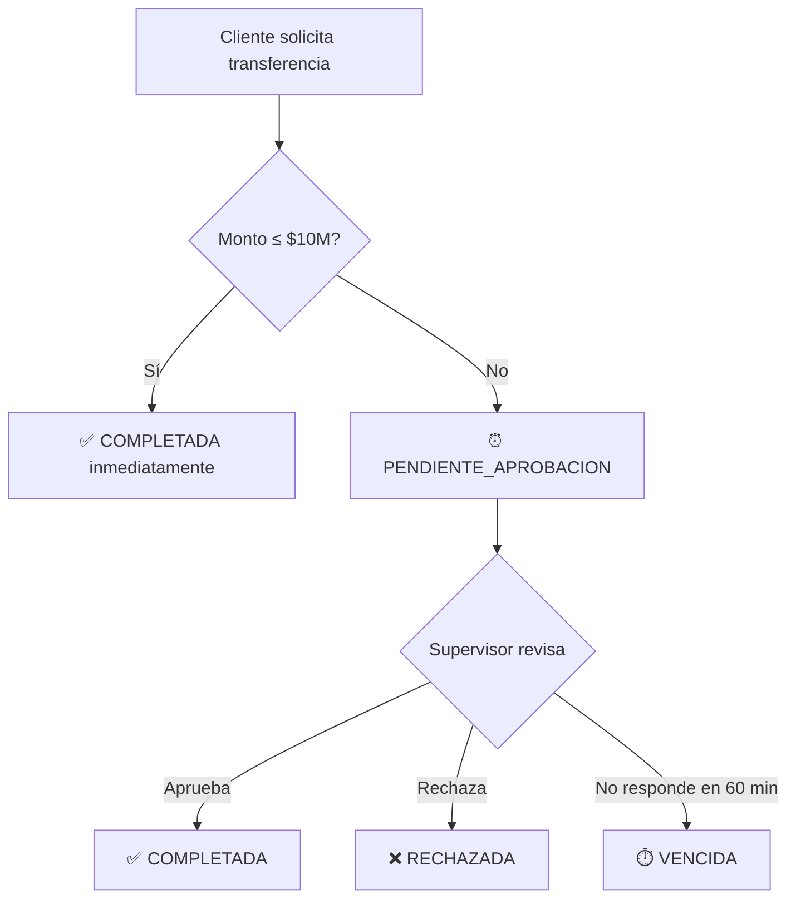
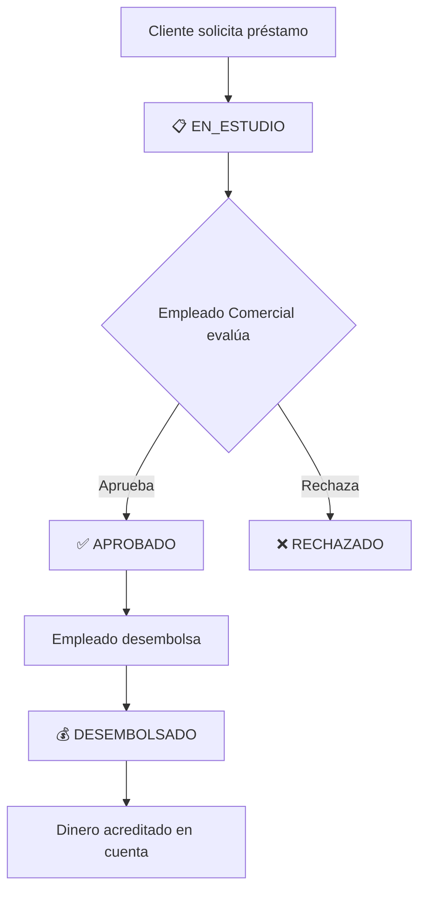

# 🎨 Guía de Integración Frontend - Sistema Bancario

## 📋 Información General

**API Backend URL**: `http://localhost:8080`  
**Documentación Interactiva**: `http://localhost:8080/swagger-ui.html`  
**OpenAPI Spec (JSON)**: `http://localhost:8080/v3/api-docs`  
**Base de Datos**: H2 in-memory (dev) - la data se borra al reiniciar  
**Autenticación**: HTTP Basic Authentication

---

## 🔐 Autenticación

### Configuración
- **Tipo**: Basic Authentication
- **Header**: `Authorization: Basic <base64(username:password)>`
- **Encoding**: Base64 de `username:password`

### Ejemplo de Implementación (JavaScript/React)
```javascript
// Crear header de autenticación
const username = 'analista';
const password = 'password';
const token = btoa(`${username}:${password}`); // Base64 encode

// Axios
axios.defaults.headers.common['Authorization'] = `Basic ${token}`;

// Fetch API
fetch('http://localhost:8080/api/clientes', {
  headers: {
    'Authorization': `Basic ${token}`,
    'Content-Type': 'application/json'
  }
});
```

---

## 👥 Usuarios de Prueba (Precargados)

| Username | Password | Rol | Descripción |
|----------|----------|-----|-------------|
| `analista` | `password` | ANALISTA_INTERNO | Auditoría, bitácora completa |
| `ventanilla` | `password` | EMPLEADO_VENTANILLA | Operaciones de caja (depositar, retirar) |
| `comercial` | `password` | EMPLEADO_COMERCIAL | Gestión de préstamos y ventas |
| `supervisor` | `password` | SUPERVISOR_EMPRESA | Aprobaciones de transferencias |
| `empleado_empresa` | `password` | EMPLEADO_EMPRESA | Operaciones empresariales |
| `cliente_natural` | `password` | CLIENTE_PERSONA_NATURAL | Cliente persona natural |
| `cliente_empresa` | `password` | CLIENTE_EMPRESA | Cliente empresa |

---

## 🗂️ Endpoints de la API

### 1️⃣ Gestión de Clientes (`/api/clientes`)

#### Crear Cliente
**Endpoint**: `POST /api/clientes`  
**Roles**: `EMPLEADO_VENTANILLA`, `EMPLEADO_COMERCIAL`

```json
{
  "tipoDocumento": "CC",
  "numeroDocumento": "1234567890",
  "nombre": "Juan Pérez",
  "email": "juan@ejemplo.com",
  "telefono": "3001234567",
  "direccion": "Calle 123 #45-67",
  "ciudad": "Bogotá",
  "tipoCliente": "PERSONA_NATURAL",
  "fechaNacimiento": "1990-01-15"
}
```

**Validaciones importantes**:
- `tipoDocumento`: `CC`, `CE`, `NIT`, `PASAPORTE`
- `tipoCliente`: `PERSONA_NATURAL`, `EMPRESA`
- `fechaNacimiento`: Solo para PERSONA_NATURAL, edad ≥ 18 años
- `email`: Formato válido (regex)
- `telefono`: 7-15 dígitos
- `numeroDocumento`: Único en el sistema

---

### 2️⃣ Gestión de Cuentas (`/api/cuentas`)

#### Crear Cuenta
**Endpoint**: `POST /api/cuentas`  
**Roles**: `EMPLEADO_VENTANILLA`, `EMPLEADO_COMERCIAL`

```json
{
  "clienteId": 1,
  "tipoCuenta": "AHORROS",
  "saldoInicial": 1000000.00
}
```

**Tipos de cuenta**: `AHORROS`, `CORRIENTE`  
**Saldo mínimo**: ≥ 0

#### Consultar Saldo
**Endpoint**: `GET /api/cuentas/{id}/saldo`  
**Roles**: Propietario de cuenta, Empleados, Analista

**Response**:
```json
{
  "cuentaId": 1,
  "numeroCuenta": "0012345678",
  "saldo": 1000000.00,
  "estado": "ACTIVA"
}
```

#### Depositar Dinero
**Endpoint**: `POST /api/cuentas/{id}/depositar?monto=50000`  
**Roles**: `EMPLEADO_VENTANILLA`

#### Retirar Dinero
**Endpoint**: `POST /api/cuentas/{id}/retirar?monto=30000`  
**Roles**: `EMPLEADO_VENTANILLA`

---

### 3️⃣ Transferencias (`/api/transacciones`)

#### Solicitar Transferencia
**Endpoint**: `POST /api/transacciones/transferir`  
**Roles**: Propietario de cuenta origen

```json
{
  "cuentaOrigenId": 1,
  "cuentaDestinoId": 2,
  "monto": 15000000.00,
  "descripcion": "Pago de servicios"
}
```

**⚠️ Flujo de Aprobación**:
- **Si monto ≤ $10,000,000**: Estado `COMPLETADA` (inmediato)
- **Si monto > $10,000,000**: Estado `PENDIENTE_APROBACION`
  - Requiere aprobación de `SUPERVISOR_EMPRESA`
  - ⏰ Se vence automáticamente a los **60 minutos** → estado `VENCIDA`

#### Aprobar Transferencia
**Endpoint**: `POST /api/transacciones/{id}/aprobar`  
**Roles**: `SUPERVISOR_EMPRESA`

#### Listar Transacciones
**Endpoint**: `GET /api/transacciones?cuentaId=1&estado=PENDIENTE_APROBACION`  
**Roles**: Según contexto (propietario, empleados)

**Estados posibles**:
- `COMPLETADA`
- `PENDIENTE_APROBACION`
- `RECHAZADA`
- `VENCIDA`

---

### 4️⃣ Préstamos (`/api/prestamos`)

#### Solicitar Préstamo
**Endpoint**: `POST /api/prestamos`  
**Roles**: Propietario de cuenta

```json
{
  "cuentaId": 1,
  "monto": 5000000.00,
  "plazoMeses": 24,
  "tasaInteres": 12.5,
  "descripcion": "Préstamo de vivienda"
}
```

**Estado inicial**: `EN_ESTUDIO`

**Validaciones**:
- `monto`: ≥ $100,000
- `plazoMeses`: 1-360 (1 mes a 30 años)
- `tasaInteres`: 0-100%

#### Aprobar Préstamo
**Endpoint**: `POST /api/prestamos/{id}/aprobar`  
**Roles**: `EMPLEADO_COMERCIAL`

Estado: `EN_ESTUDIO` → `APROBADO`

#### Rechazar Préstamo
**Endpoint**: `POST /api/prestamos/{id}/rechazar`  
**Roles**: `EMPLEADO_COMERCIAL`

Estado: `EN_ESTUDIO` → `RECHAZADO`

#### Desembolsar Préstamo
**Endpoint**: `POST /api/prestamos/{id}/desembolsar`  
**Roles**: `EMPLEADO_COMERCIAL`

Estado: `APROBADO` → `DESEMBOLSADO`  
**⚡ Acredita el dinero en la cuenta del cliente**

#### Listar Préstamos
**Endpoint**: `GET /api/prestamos?estado=EN_ESTUDIO`

**Estados posibles**:
- `EN_ESTUDIO`
- `APROBADO`
- `RECHAZADO`
- `DESEMBOLSADO`

---

### 5️⃣ Bitácora/Auditoría (`/api/bitacora`)

**Endpoint**: `GET /api/bitacora`  
**Roles**: `ANALISTA_INTERNO`, `SUPERVISOR_EMPRESA`

**Query params**:
- `entidad`: CLIENTE, CUENTA, PRESTAMO, TRANSFERENCIA
- `entidadId`: ID específico
- `accion`: CREAR, MODIFICAR, ELIMINAR
- `fechaInicio`: 2026-03-01
- `fechaFin`: 2026-03-31

**Ejemplo**:
```
GET /api/bitacora?entidad=PRESTAMO&entidadId=1
GET /api/bitacora?accion=CREAR&fechaInicio=2026-03-01
```

---

## 🛡️ Matriz de Permisos por Rol

| Operación | Cliente Natural | Cliente Empresa | Empleado Ventanilla | Empleado Comercial | Supervisor | Analista |
|-----------|----------------|-----------------|---------------------|-------------------|-----------|----------|
| Crear cliente | ❌ | ❌ | ✅ | ✅ | ❌ | ❌ |
| Crear cuenta | ❌ | ❌ | ✅ | ✅ | ❌ | ❌ |
| Consultar saldo | 👤 propio | 👤 propio | ✅ todas | ✅ todas | ✅ todas | ✅ todas |
| Depositar/Retirar | ❌ | ❌ | ✅ | ❌ | ❌ | ❌ |
| Transferir | 👤 propio | 👤 propio | ❌ | ❌ | ❌ | ❌ |
| Aprobar transferencia | ❌ | ❌ | ❌ | ❌ | ✅ | ❌ |
| Solicitar préstamo | 👤 propio | 👤 propio | ❌ | ❌ | ❌ | ❌ |
| Aprobar préstamo | ❌ | ❌ | ❌ | ✅ | ❌ | ❌ |
| Desembolsar préstamo | ❌ | ❌ | ❌ | ✅ | ❌ | ❌ |
| Ver bitácora | ❌ | ❌ | ❌ | ❌ | ✅ | ✅ |

**👤** = Solo sus propios recursos

---

## 🎨 Sugerencias de UI/UX

### Dashboard según Rol

```javascript
const componentes = {
  CLIENTE_PERSONA_NATURAL: [
    'MisCuentas',
    'SolicitarPrestamo', 
    'HacerTransferencia',
    'HistorialMovimientos'
  ],
  
  EMPLEADO_VENTANILLA: [
    'RegistrarCliente',
    'AbrirCuenta',
    'RealizarDeposito',
    'RealizarRetiro',
    'BuscarCliente'
  ],
  
  EMPLEADO_COMERCIAL: [
    'GestionPrestamos',
    'PrestamosEnEstudio',
    'AbrirCuentas',
    'RegistrarClientes'
  ],
  
  SUPERVISOR_EMPRESA: [
    'TransferenciasPendientes',
    'AprobarTransferencias',
    'ReporteOperaciones',
    'VerBitacora'
  ],
  
  ANALISTA_INTERNO: [
    'BitacoraCompleta',
    'Auditoria',
    'EstadisticasGenerales',
    'ReportesFraude'
  ]
};
```

### Estados Visuales Recomendados

```javascript
const estadosUI = {
  // Préstamos
  EN_ESTUDIO: { 
    color: '#FFA500', // naranja
    icon: '⏳', 
    label: 'En Evaluación',
    badge: 'warning'
  },
  APROBADO: { 
    color: '#28A745', // verde
    icon: '✅', 
    label: 'Aprobado',
    badge: 'success'
  },
  RECHAZADO: { 
    color: '#DC3545', // rojo
    icon: '❌', 
    label: 'Rechazado',
    badge: 'danger'
  },
  DESEMBOLSADO: { 
    color: '#17A2B8', // azul
    icon: '💰', 
    label: 'Desembolsado',
    badge: 'info'
  },
  
  // Transferencias
  COMPLETADA: { 
    color: '#28A745', 
    icon: '✅', 
    label: 'Completada',
    badge: 'success'
  },
  PENDIENTE_APROBACION: { 
    color: '#FFA500', 
    icon: '⏰', 
    label: 'Pendiente Aprobación',
    badge: 'warning'
  },
  VENCIDA: { 
    color: '#6C757D', // gris
    icon: '⏱️', 
    label: 'Vencida',
    badge: 'secondary'
  },
  RECHAZADA: { 
    color: '#DC3545', 
    icon: '❌', 
    label: 'Rechazada',
    badge: 'danger'
  }
};
```

### Notificaciones Importantes

```javascript
// Alertas críticas para mostrar al usuario
const notificaciones = {
  TRANSFERENCIA_REQUIERE_APROBACION: {
    tipo: 'warning',
    mensaje: '⏰ Esta transferencia requiere aprobación de un supervisor (monto > $10M)',
    duracion: 5000
  },
  
  TRANSFERENCIA_PROXIMA_VENCER: {
    tipo: 'danger',
    mensaje: '⚠️ Esta transferencia vencerá en menos de 10 minutos',
    duracion: 0 // No cerrar automáticamente
  },
  
  PRESTAMO_APROBADO: {
    tipo: 'success',
    mensaje: '✅ Tu préstamo ha sido aprobado. Pronto será desembolsado.',
    duracion: 8000
  },
  
  DEPOSITO_RECIBIDO: {
    tipo: 'info',
    mensaje: '💵 Has recibido un depósito. Verifica tu saldo.',
    duracion: 6000
  },
  
  EDAD_INSUFICIENTE: {
    tipo: 'danger',
    mensaje: '❌ Debes tener al menos 18 años para abrir una cuenta',
    duracion: 5000
  }
};
```

---

## 🔄 Flujos de Negocio Clave

### Flujo de Transferencias



### Flujo de Préstamos



---

## 📦 Setup Rápido con Axios (React)

```javascript
// src/api/axios.js
import axios from 'axios';

const api = axios.create({
  baseURL: 'http://localhost:8080/api',
  headers: {
    'Content-Type': 'application/json'
  }
});

// Interceptor para agregar token de autenticación
api.interceptors.request.use(config => {
  const username = localStorage.getItem('username');
  const password = localStorage.getItem('password');
  
  if (username && password) {
    const token = btoa(`${username}:${password}`);
    config.headers.Authorization = `Basic ${token}`;
  }
  
  return config;
});

// Interceptor para manejar errores
api.interceptors.response.use(
  response => response,
  error => {
    if (error.response?.status === 401) {
      // Usuario no autenticado - redirigir a login
      localStorage.removeItem('username');
      localStorage.removeItem('password');
      window.location.href = '/login';
    } else if (error.response?.status === 403) {
      // No tiene permisos - mostrar mensaje
      alert('❌ No tienes permisos para realizar esta acción');
    }
    return Promise.reject(error);
  }
);

export default api;
```

### Ejemplos de Uso

```javascript
// src/services/cuentaService.js
import api from '../api/axios';

export const cuentaService = {
  // Consultar saldo
  consultarSaldo: async (cuentaId) => {
    const response = await api.get(`/cuentas/${cuentaId}/saldo`);
    return response.data;
  },
  
  // Crear cuenta
  crearCuenta: async (datos) => {
    const response = await api.post('/cuentas', datos);
    return response.data;
  }
};

// src/services/prestamoService.js
import api from '../api/axios';

export const prestamoService = {
  // Solicitar préstamo
  solicitar: async (datos) => {
    const response = await api.post('/prestamos', datos);
    return response.data;
  },
  
  // Listar préstamos
  listar: async (filtros) => {
    const params = new URLSearchParams(filtros);
    const response = await api.get(`/prestamos?${params}`);
    return response.data;
  },
  
  // Aprobar préstamo
  aprobar: async (prestamoId) => {
    const response = await api.post(`/prestamos/${prestamoId}/aprobar`);
    return response.data;
  }
};

// src/services/transaccionService.js
import api from '../api/axios';

export const transaccionService = {
  // Transferir dinero
  transferir: async (datos) => {
    const response = await api.post('/transacciones/transferir', datos);
    return response.data;
  },
  
  // Aprobar transferencia
  aprobar: async (transaccionId) => {
    const response = await api.post(`/transacciones/${transaccionId}/aprobar`);
    return response.data;
  }
};
```

---

## ✅ Validaciones Frontend (Pre-envío)

```javascript
// Validaciones recomendadas antes de enviar al backend
const validaciones = {
  cliente: {
    edad: (fechaNacimiento) => {
      const edad = calcularEdad(fechaNacimiento);
      return edad >= 18;
    },
    email: (email) => {
      const regex = /^[A-Za-z0-9+_.-]+@(.+)$/;
      return regex.test(email);
    },
    telefono: (telefono) => {
      const digitos = telefono.replace(/\D/g, '');
      return digitos.length >= 7 && digitos.length <= 15;
    }
  },
  
  cuenta: {
    saldoInicial: (saldo) => saldo >= 0
  },
  
  prestamo: {
    monto: (monto) => monto >= 100000,
    plazoMeses: (plazo) => plazo >= 1 && plazo <= 360,
    tasaInteres: (tasa) => tasa >= 0 && tasa <= 100
  },
  
  transferencia: {
    monto: (monto) => monto >= 1000,
    requiereAprobacion: (monto) => monto > 10000000
  }
};

// Helper para calcular edad
function calcularEdad(fechaNacimiento) {
  const hoy = new Date();
  const nacimiento = new Date(fechaNacimiento);
  let edad = hoy.getFullYear() - nacimiento.getFullYear();
  const mes = hoy.getMonth() - nacimiento.getMonth();
  if (mes < 0 || (mes === 0 && hoy.getDate() < nacimiento.getDate())) {
    edad--;
  }
  return edad;
}
```

---

## 🛠️ Recursos Disponibles

### Documentación API
- **Swagger UI**: http://localhost:8080/swagger-ui.html
  - Interfaz interactiva para probar endpoints
  - Ver estructura exacta de requests/responses
  - Documentación de errores

- **OpenAPI JSON**: http://localhost:8080/v3/api-docs
  - Descargar para generar cliente automático
  - Usar con OpenAPI Generator
  - Importar en Postman/Insomnia

### Herramientas de Desarrollo
- **H2 Console**: http://localhost:8080/h2-console
  - Ver datos en tiempo real
  - JDBC URL: `jdbc:h2:mem:bankdb`
  - Username: `sa`
  - Password: _(dejar vacío)_

### Generar Cliente TypeScript
```bash
# Instalar OpenAPI Generator
npm install -g @openapitools/openapi-generator-cli

# Generar cliente TypeScript/Axios
openapi-generator-cli generate \
  -i http://localhost:8080/v3/api-docs \
  -g typescript-axios \
  -o ./src/api/generated
```

---

## 🚨 Manejo de Errores

### Códigos de Estado HTTP

| Código | Significado | Acción Frontend |
|--------|-------------|-----------------|
| 200 | ✅ Éxito | Mostrar mensaje de éxito |
| 201 | ✅ Creado | Redirigir o actualizar lista |
| 400 | ❌ Validación fallida | Mostrar errores de validación en form |
| 401 | 🔒 No autenticado | Redirigir a login |
| 403 | 🚫 Sin permisos | Mostrar mensaje "Sin permisos" |
| 404 | 🔍 No encontrado | Mostrar "Recurso no encontrado" |
| 500 | ⚠️ Error del servidor | Mostrar "Error inesperado, intenta más tarde" |

### Estructura de Respuesta de Error

```json
{
  "timestamp": "2026-03-09T15:30:00",
  "status": 400,
  "error": "Bad Request",
  "message": "La cuenta no tiene saldo suficiente",
  "path": "/api/cuentas/1/retirar"
}
```

### Ejemplo de Manejo en React

```javascript
async function handleTransferir(datos) {
  try {
    const resultado = await transaccionService.transferir(datos);
    
    if (resultado.estado === 'PENDIENTE_APROBACION') {
      showAlert('warning', '⏰ Transferencia requiere aprobación (monto > $10M)');
    } else {
      showAlert('success', '✅ Transferencia completada exitosamente');
    }
    
    navigate('/mis-transferencias');
  } catch (error) {
    if (error.response?.status === 400) {
      // Error de validación
      showAlert('danger', `❌ ${error.response.data.message}`);
    } else if (error.response?.status === 403) {
      showAlert('danger', '🚫 No tienes permisos para realizar esta operación');
    } else {
      showAlert('danger', '⚠️ Error inesperado. Intenta nuevamente.');
    }
  }
}
```

---

## 📊 Formato de Datos

### Fechas
- **Formato**: `YYYY-MM-DD` (ISO 8601)
- **Ejemplo**: `2026-03-09`
- **Zona horaria**: UTC por defecto

### Montos
- **Tipo**: `number` (decimal)
- **Formato**: `1500000.50`
- **Decimales**: Hasta 2 posiciones
- **Separador**: Punto (`.`)

### Números de Documento
- **Tipo**: `string`
- **Formato**: Numérico sin puntos ni guiones
- **Ejemplo**: `"1234567890"`

---

## 🎯 Checklist de Implementación

### Configuración Inicial
- [ ] Configurar Axios con baseURL e interceptores
- [ ] Implementar sistema de auth (login/logout/persist)
- [ ] Crear servicios para cada módulo (clientes, cuentas, préstamos, etc.)
- [ ] Configurar manejo global de errores

### Componentes Core
- [ ] Login/Logout
- [ ] Navegación según rol
- [ ] Dashboard personalizado por rol
- [ ] Sistema de notificaciones/alertas

### Módulos por Rol
#### Clientes
- [ ] Formulario de transferencia
- [ ] Historial de movimientos
- [ ] Solicitud de préstamo
- [ ] Consulta de saldo

#### Empleado Ventanilla
- [ ] Registro de clientes
- [ ] Apertura de cuentas
- [ ] Depósitos/Retiros
- [ ] Búsqueda de clientes

#### Empleado Comercial
- [ ] Gestión de préstamos
- [ ] Aprobar/Rechazar préstamos
- [ ] Desembolsar préstamos
- [ ] Apertura de cuentas

#### Supervisor
- [ ] Lista de transferencias pendientes
- [ ] Aprobar/Rechazar transferencias
- [ ] Ver bitácora
- [ ] Reportes

#### Analista
- [ ] Bitácora completa con filtros
- [ ] Auditoría de operaciones
- [ ] Estadísticas y reportes

### Funcionalidades Extra
- [ ] Manejo de estados de carga (loading)
- [ ] Paginación en listas
- [ ] Filtros y búsqueda
- [ ] Confirmaciones para acciones críticas
- [ ] Formato de moneda y fechas
- [ ] Exportar reportes (PDF/Excel)

---

## 📞 Soporte

Si tienen dudas técnicas o encuentran problemas con la API:

1. **Revisar Swagger UI**: http://localhost:8080/swagger-ui.html
2. **Verificar logs del backend**: Errores detallados en consola
3. **Consultar este documento**: Validaciones y permisos
4. **Probar endpoint en Swagger**: Confirmar que el backend funciona correctamente

---

## 🚀 Iniciar el Backend

```bash
# Desde la carpeta del proyecto
cd bank-api

# Con Maven Wrapper (recomendado)
mvnw.cmd spring-boot:run    # Windows
./mvnw spring-boot:run       # Linux/Mac

# Con Maven instalado
mvn spring-boot:run
```

La API estará disponible en **http://localhost:8080** 🎉

---

**Última actualización**: 9 de marzo de 2026  
**Versión del Backend**: 1.0.0  
**Versión de Spring Boot**: 3.3.2  
**Java Version**: 21
